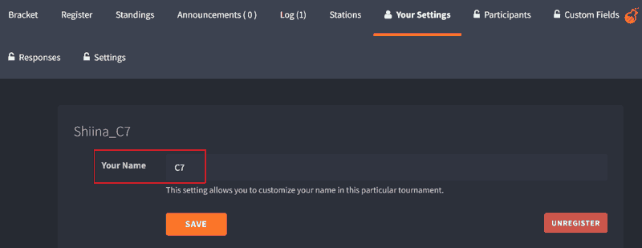

<font size="5">**单字段娱乐赛**</font>

YGOPro 线上赛

- 由暗瓜玩家主办, 幻想崩坏赞助, C7 承办
- 无报名费
- 奖品由瓜和崩坏提供, 冠军 250 元, 亚军 150 元, 四强 50 元
- 双卡组征服赛制
- 时间线
    - 报名截止: 2022 年 6 月 10 日 (周五) 10:00
    - 瑞士轮 5 轮: 6 月 11 日 18:00 开始, 每轮至多 1 小时, 视情况提前开始下一轮
    - 出 8 强单淘: 6 月 12 日 18:00 开始
    
[群号](#群号)

## Checklist

本赛 Challonge 主页见 [这里](https://challonge.com/py1brfcs).

你需要

1. 按 [规则](#卡组构筑规则) 构筑两套卡组.
2. 按 [报名指南](#报名指南) 提交卡组并在 Challonge 上登记. 把群名片改为参赛昵称.
3. 按 [参赛指南](#参赛指南) 赛前签到, 完成比赛, 保存录像, 自己上报成绩. 下一轮开始前确认上一轮成绩是否填报正确.

比赛结束后公开选手卡组. 进入淘汰赛的选手赛后需提供并公开全程录像. **赛后无法提交全程录像的选手取消获奖资格.** 赛后选手有 72 小时举报/申诉时间, 之后结算名次和奖品.
    
关于规则的疑问由瓜负责解释, 其他两项由 C7 (我) 负责解释.

## 卡组构筑规则

无禁止・限制・准限制卡表, 所有卡均可投入最多 3 张 (需遵守下述规则).

### 字段的含义

在本比赛中, 选手需要指定一个 "字段" 来构建卡组 (每套卡组各只用一个字段, 两套卡组所用字段需不同). "字段" 在本次比赛的内涵包括:

- 如果某张卡的记述包含 "「XXX」卡/魔法/陷阱/怪兽" 等，那么「XXX」可视为 "字段";
- 任意一张卡的卡名《XXX》也可作为 "字段".

**特例:**【英雄】不视为字段,【元素英雄】【命运英雄】等正常作为字段.

### 允许投入的卡片

选定字段后, 主卡组・额外卡组只能投入至少满足以下一个条件的卡：

1. 卡名包含该 "字段".
2. 卡片效果文记述包含该 "字段".
3. 主卡组投入的且满足条件 1 的卡片的效果文记述了全名的卡.

**例** 下面用书名号《》表示卡名, 方头括号【】表示字段名.

1. 【六武众】卡组可以投入所有的【影六武众】【真六武众】.
2. 【阿不思的落胤】卡组可以投入所有卡片效果记述有《阿不思的落胤》的卡.
3. 投入《电子灯塔》的【电子】卡组可以投入《力量结合》, 投入《魔玩具补缀》的【魔玩具】卡组可以投入《融合》.

**例** 我要组【元素英雄】卡组:

- 可以投入《英雄到来》类卡片效果文记述了【元素英雄】的卡.
- 可以投入被《元素英雄 烈焰侠》记述的最多 3 张《融合》.
- 不可以投入《幻影英雄 仿生人》这类只记述了【英雄】的卡 (特例规则【英雄】不视为字段).

<details><summary>▷ <b>关于一些字段的解释</b></summary>

- 以日文为准. 例如《机巧蛇 从云远吕智》不视为《借机巧藏》的【机巧】字段.
- 【烙印】【帝王】等, 字段标注为 "「XXX」魔法陷阱卡" 的, 只能投入 (1)「XXX」魔法陷阱卡, (2) 卡片效果文记述有 "「XXX」魔法陷阱卡" 的卡, 和 (3) 主卡组投入的「XXX」魔法陷阱卡效果文记述了全名的卡.
- 《蒂迈欧之眼》记述的是 "《黑魔术师》怪兽", 在 OCG 规则上不视为记述了《黑魔术师》的卡 (不能被《魂之仆人》等卡检索). 在本次比赛中则认为是 "黑魔术师" 字段.
</details>

## 报名指南

两件事: 邮件提交卡组, 并在 Challonge 上登记.

### 邮件提交卡组

唯一指定方式: 用邮件提交. 比赛前一天 10:00 截止提交.

- 用 **qq 邮箱** (数字@qq.com, 不要用别名邮箱) 发送邮件至 C7 的邮箱

```
448070927@qq.com
```

- 主题名为 `单字段报名: 比赛用的昵称`. 前缀 `单字段报名:` 为固定字段, 不填写会导致收不到邮件. 例如 

```
单字段报名: C7
``` 

- 内容不填
- 附件只提交 **两个** 卡组的 ydk 文件, 文件名为 `所用字段.ydk`. 字段以 YGOPRO 采用的翻译为准, 需要清楚规范. 例如「闪刀.ydk」, **不要** 写为「闪刀姬.ydk」「【闪刀】.ydk」.
	
后续要更新卡组同样按上述格式重新发送邮件即可.

发送邮件后正常情况一天内会收到报名成功的邮件. 如果失败则会收到报名失败的邮件, 请再次确认邮件符合上述格式. 如果符合上述格式但没收到邮件请私信我.

### 在 Challonge 上登记

注册登录账号, 在 [Challonge 赛事主页](#checklist) 登记.

<details><summary>▷ <b>如果验证码打不开 (reCAPTCHA verification failed)</b></summary>

参考 [这篇文章](https://zhuanlan.zhihu.com/p/463307906), 把文中第二个网址替换为 https://www.recaptcha.net/recaptcha/api.js

</details>

在 Your Settings 中把参赛名替换为参赛昵称, 如下图.



## 参赛指南

在开赛前 2 小时 (14:00~18:00) 要在赛事主页上 check-in. 赛前没有签到的选手视为弃赛.

**统一参赛昵称:** QQ 群名片, Challonge 上的参赛名, YGOPRO 使用的昵称.

每轮打完后胜者在页面上填写成绩.

### 比赛规则

双卡组 [征服赛制](#征服赛制).

每轮 40 分钟后进入 [额外回合](#额外回合) (时机由群内通知为准).

#### 迟到

需要在群里 at 或私聊迟到的对手.

- 迟到 5 min, 判 G1 落败 (对手只需要用任意一套卡组获胜即 match 获胜, 途中可以更换卡组).
- 迟到 10 min, 判 match 落败.
- 无故迟到并在本轮结束后仍未向裁判报告的选手视为退赛.

#### 掉线

- 2333 有掉线重连机制. 掉线后重连失败的玩家单局落败.
- 由于服务器原因集体掉线的场合, 受影响的玩家全部重开.

### YGOPRO 设置


注意把昵称改为参赛名, 密码统一为 `TM5,NF#单字段+对阵表上的桌号`, 如

```
主机: s1.ygo233.com:2333
主机密码: TM5,NF#单字段1
```

单局模式, 无禁限, 每回合 5 分钟. 打 2~3 个单局.

每局打完后保存录像, 名称为 `Rx 自己名称 vs 对手名称 默认生成的时间戳`, 其中 x 表示第几轮比赛, 如第 2 轮

```
R2 C7 vs C8 2022-05-26 23-15-34
```

### 自助报告成绩


在 score 这里填写对局结果, 2:0, 2:1, 1:0 等, 下面会根据比分自动给出胜者, 确认后提交.

由胜者填写分数. 平局时对阵表中位于上面的选手填写, 如上图为 C7, 6, 5.

在下轮开始前检查分数填写是否正确.

## 附录

### 征服赛制

选手使用准备好的两套卡组轮番对阵, 直至一方两套卡组都获得过胜利, 该方 match 获胜.

- 每局胜者需换用另一套未获得过胜利的卡组进行下局对战.
- 每局败者可以继续使用当前卡组, 也可更换卡组.
- 败者决定下一局先后攻.

单局平局的场合

- 若之前比分不为 1:1, 则双方当前卡组均视为胜利.
- 若比分为 1:1, 则 LP 多者获胜. LP 相同的场合, 瑞士轮算平局, 淘汰赛则重赛当前小局.

返回 [比赛规则](#比赛规则)

### 额外回合

- 进入额外回合时, 当前玩家为第 0 回合. 第 3 回合结束后 LP 多的玩家获胜, **LP 相同的场合该 game 平局**.
- 如果在 game 1 进入额外回合, 则根据 game 1 结果判定本场 match 结果, 不再进行 game 2. 
- 如果在 game 2 进入额外回合. 当前小局结束后, 
    - **如果是瑞士轮, 则直接结算 match 结果**, 不再进行 game 3.
    - 如果是单淘打成 1:1, 则 game 3 进入额外决斗 (Extra Duel), 4 回合后 LP 多的玩家获胜; LP 相同的场合进入 sudden death: 在双方 LP 出现任何变动的一刻比赛终止, LP 多的一方获胜.

如果感到对方在拖延时间, 请保留相关证据, 并及时呼叫裁判. Slow play (不必要地花长时间才作出动作) 从重判罚.

返回 [比赛规则](#比赛规则)

### 瑞士轮算法

使用 Challonge 自动编排对阵, 大分与 KTS 设置一致

```
大分 = 胜场 * 3 + 平局数 * 1 + 败场 * 0
```

小分用 Challonge 默认设置, 依次为 Wins vs Tied Participants, Median-Buchholz system, Points Difference. 

小分全部相同的场合, 依次适用 Tracker 的三个破同分法则; 依然相同的场合, 依次适用 KTS 的破同分法则; 依然相同的场合, 涉及到的选手重赛.

比赛期间 Challonge 网站维护的场合, 转为 KTS 编排对阵.

详细科普可见

- [Challonge tiebreakers](https://feedback.challonge.com/knowledgebase/articles/448540-rank-tie-break-statistics)
- [Tracker and KTS tiebreakers](https://mp.weixin.qq.com/s/jwZVkYOZNIgwzCDhb-qkdg)
- [Challonge 的瑞士轮匹配机制](https://mp.weixin.qq.com/s/3b75Z2c3GC4bJWfmtWcS0g)

<details><summary>▷ <b>为什么设置这么多小分?</b></summary>

因为以前 C 盟出过事故, 见 [论游戏王线上联赛主裁雪花的 "公平公正"](https://card.weibo.com/article/m/show/id/2309404470147241869478?ua=Mozilla%2F5.0+%28Linux%3B+Android+12%3B+M2102J2SC+Build%2FSKQ1.211006.001%3B+wv%29+AppleWebKit%2F537.36+%28KHTML%2C+like+Gecko%29+Version%2F4.0+Chrome%2F100.0.4896.79+Mobile+Safari%2F537.36Mi+10S_12_WeiboIntlAndroid_4190). 原因是主办不知道算分机制, 要求重赛但无法给出令选手信服的解释.

~~床单: 结论是以后比赛带个 C7.~~
</details>

### 常规判罚

用决斗以外的方式决定胜负 / 蓄意伪造对战结果. 判罚: 取消参赛资格和获奖资格.

若有上位选手被取消获奖资格, 排名顺延 (四强和八强内按照瑞士轮排名顺延).

### 参考材料

- [YGOPro 233服 使用方法](https://ygo233.com/usage)
- [《炉石传说》黄金公开赛 选手手册](https://blz.nosdn.127.net/2/Gold/hs/2022GoldOpen/Nanning/黄金公开赛-2022+南宁站+.pdf)

### 群号

